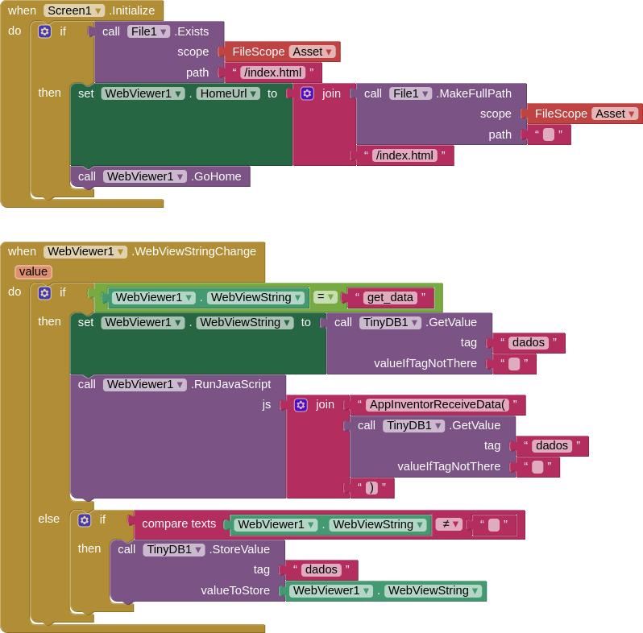

### README

# Expense Tracker App

This repository contains the source code for the "Expense Tracker" app, a simple and intuitive application to manage your finances. The app allows you to track your income, set monthly spending limits, add expenses, and visualize your financial data through clear and informative charts.

**Note:** This app has been published on the Play Store and can be accessed [here](https://play.google.com/store/apps/details?id=appinventor.ai_iagolirapassos.Financas). The source code provided in this repository is for educational purposes only and should not be used for commercial purposes.

## Features

- Manage monthly income and expenses.
- Set and track monthly spending limits.
- Add and delete expenses.
- View detailed financial statistics.
- Visualize data with horizontal bar charts.
- Store data locally using TinyDB in MIT App Inventor.
- User-friendly interface with tooltips for additional information.

## Getting Started

### Prerequisites

- MIT App Inventor account
- Basic knowledge of JavaScript and HTML

### Project Structure

- `index.html`: The main HTML file that contains the structure of the app.
- `styles.css`: The CSS file that styles the app.
- `script.js`: The JavaScript file that handles the app's logic.
- `icon.png`: The app icon.
- `banner.png`: The app banner image.
- `blocks.png`: The image of the MIT App Inventor blocks.

### How to Integrate with WebView in MIT App Inventor

1. **Set Up WebView Component:**

   - Open your project in MIT App Inventor.
   - Add a `WebViewer` component to your screen and set its properties:
     - `Home URL`: Set to the URL of your `index.html` file.
     - `WebViewString`: Leave it empty initially.
     - `Ignore SSL Errors`: Check this if necessary.

2. **Add TinyDB Component:**

   - Add a `TinyDB` component to your screen and name it `TinyDB1`.

3. **Configure WebViewer.WebViewStringChange Event:**

   - Go to the Blocks section and add the following blocks to manage data storage and retrieval:

   

   ```plaintext
   When WebViewer.WebViewStringChange:
       if (WebViewer.WebViewString = "get_data") {
           set TinyDBData to call TinyDB1.GetValue tag "data" valueIfTagNotThere "{}"
           call WebViewer.WebViewString to set WebViewer.WebViewString to TinyDBData
           call WebViewer.EvaluateJavaScript "AppInventorReceiveData(" + TinyDBData + ")"
       } else {
           call TinyDB1.StoreValue tag "data" value WebViewer.WebViewString
       }
   ```

4. **Modify JavaScript to Handle Data from TinyDB:**

   - Ensure that your JavaScript code includes functions to handle data retrieval and storage using `window.AppInventor.setWebViewString` and `window.AppInventorReceiveData`.

   ```javascript
   window.AppInventorReceiveData = function(dados) {
       try {
           if (dados) {
               const dadosParse = typeof dados === 'string' ? JSON.parse(dados) : dados;
               limiteGasto = dadosParse.limiteGasto || 0;
               receitaMensal = dadosParse.receitaMensal || 0;
               gastos = Array.isArray(dadosParse.gastos) ? dadosParse.gastos : [];
               abaAtiva = dadosParse.abaAtiva || 'controle';

               // Update HTML values
               document.getElementById('receitaMensal').value = receitaMensal;
               document.getElementById('limite').value = limiteGasto;

               atualizarLista();
               atualizarStatus();
               ativarAba(abaAtiva);
           }
       } catch (error) {
           mostrarErro('Erro ao receber dados: ' + error.message);
       }
   };

   function carregarDados() {
       try {
           window.AppInventor.setWebViewString("get_data");
       } catch (error) {
           mostrarErro('Erro ao carregar dados: ' + error.message);
       }
   }

   function salvarDados() {
       try {
           const dados = {
               limiteGasto,
               receitaMensal,
               gastos,
               abaAtiva
           };
           window.AppInventor.setWebViewString(JSON.stringify(dados));
       } catch (error) {
           mostrarErro('Erro ao salvar dados: ' + error.message);
       }
   }
   ```

5. **Initial Data Load:**

   - Ensure the data is loaded when the WebView is ready.

   ```javascript
   window.addEventListener('load', () => {
       try {
           carregarDados();
       } catch (error) {
           mostrarErro('Erro ao carregar a página: ' + error.message);
       }
   });
   ```

### Running the Project

1. Clone the repository to your local machine.

   ```bash
   git clone https://github.com/yourusername/expense-tracker-app.git
   ```

2. Open `index.html` in a web browser to preview the app.

3. Upload `index.html`, `styles.css`, `script.js`, `icon.png`, and `banner.png` to your MIT App Inventor project resources.

4. Configure the WebViewer and TinyDB components as described above.

### Contact

For any questions or support, please contact:

**Email:** [iagolirapassos@gmail.com](mailto:iagolirapassos@gmail.com)

### License

This project is licensed under the Creative Commons Attribution-NonCommercial 4.0 International (CC BY-NC 4.0). For more details, see the [LICENSE](LICENSE) file.

---

By following this README, developers can understand the structure and functionality of the "Expense Tracker" app, integrate it with MIT App Inventor's WebView component, and properly configure the necessary TinyDB blocks to store and retrieve data. The source code is provided for educational purposes only and should not be used for commercial purposes.